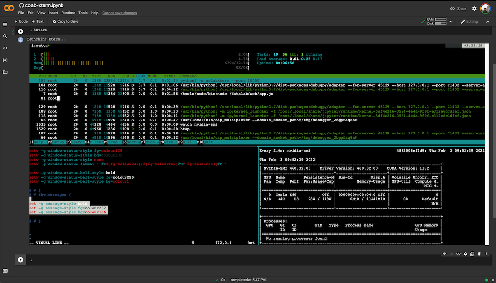

# colab-xterm
Colab-xterm allows you to open a terminal in a cell.

# Usage

1. Install package and load the extension
    ```
    !pip install colab-xterm
    %load_ext colabxterm
    ```
2. Open a terminal
    ```
    %xterm
    ```
3. Enjoy!

Try it out in the demo notebook. 

[](https://colab.research.google.com/github/infuseai/colab-xterm/blob/main/demo.ipynb)

# Features
- TTY support
- Does not block your kernel

# Screenshots
